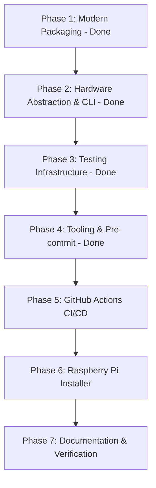

# Modernization Plan: Auto Zoom Controller

**Status**: In Progress (Phase 1 Complete)
**Date**: 2026-10-06
**Document**: `docs/plans/modernization_plan.md`

---

## 1. Executive Summary & Goals

The `auto-zoom-controller` project controls a stepper motor connected via a Waveshare Stepper Motor HAT (DRV8825) on a Raspberry Pi for automated camera lens zooming during timelapse shoots.

While the core functionality and hardware wiring are sound, the codebase relies on legacy Python packaging practices (`setup.cfg`, `setup.py`), lacks automated CI/CD testing, has hardcoded runtime parameters in `main.py`, cannot be tested on non-Raspberry Pi environments (due to hard dependencies on `RPi.GPIO`), and lacks an automated setup script for modern Raspberry Pi OS (Debian 12 Bookworm).

### Primary Goals
1. **Modern Python Standards (PEP 517/518/621)**: Consolidate configuration into a declarative `pyproject.toml` and remove deprecated setup scripts.
2. **Flexible CLI & Hardware Mocking**: Introduce an `argparse` CLI with configurable parameters (`--interval`, `--duration`, `--steps`, `--direction`, `--dry-run`) and a hardware abstraction/mock for non-Pi development.
3. **Robust Testing Framework**: Move tests to a root-level `tests/` directory with `pytest` and comprehensive unit coverage.
4. **Code Quality & Speed**: Standardize formatting and linting with `ruff` and configure `.pre-commit-config.yaml`.
5. **Continuous Integration & Delivery**: Implement GitHub Actions workflows for multi-version matrix testing and tag-based release builds.
6. **One-Command Raspberry Pi Deployment**: Provide an automated installer script (`scripts/install_pi.sh`) handling virtual environments and Pi OS compatibility.

---

## 2. Current State vs. Target State

| Dimension | Current State | Target Modern State |
|---|---|---|
| **Packaging** | `setup.cfg` + `setup.py` + minimal `pyproject.toml` | Single, declarative `pyproject.toml` (PEP 621) |
| **Versioning** | Static / partial `setuptools_scm` | Dynamic Git tag versioning via `setuptools_scm` |
| **CLI & Usage** | Hardcoded values in `main.py` | Configurable CLI (`auto-zoom`) with `--dry-run` |
| **Hardware Coupling** | Direct `import RPi.GPIO` fails on Mac/PC/CI | Hardware abstraction layer with automatic Mock/Dummy GPIO fallback |
| **Tests** | Inside `src/test/` using basic `unittest` | Root-level `tests/` with `pytest`, fixtures, and coverage |
| **Linting & Formatting** | None configured | `ruff` (lint + format) in `pyproject.toml` |
| **CI/CD** | None | GitHub Actions matrix (`3.9` to `3.13`) + Release workflow |
| **Pi Installation** | Manual multi-step README instructions | One-step installer script (`scripts/install_pi.sh`) |
| **Dev Tooling** | Manual commands | `Makefile` (`make test`, `make lint`, `make install`) |

---

## 3. Implementation Phases



### Phase 1: Modern Packaging (PEP 621 / PEP 517) - [COMPLETED]
- [x] **File**: `pyproject.toml`
  - [x] Migrate all metadata from `setup.cfg` into `pyproject.toml` using `[project]`.
  - [x] Configure build backend: `setuptools.build_meta`.
  - [x] Configure dependencies:
    - [x] Core: `schedule>=1.1.0`
    - [x] Optional `[project.optional-dependencies]`:
      - `dev`: `pytest`, `pytest-cov`, `ruff`, `pre-commit`
      - `pi`: `rpi-lgpio` (modern Pi OS Bookworm) / `RPi.GPIO` (legacy Bullseye)
  - [x] Configure CLI entrypoints:
    - `auto-zoom = "auto_zoom_controller.main:main"`
    - `auto-zoom-controller = "auto_zoom_controller.main:main"`
  - [x] Configure `[tool.setuptools_scm]` with fallback version `0.1.0`.
- [x] **Cleanup**: Removed `setup.cfg` and `setup.py`.


### Phase 2: Hardware Abstraction, Imports & CLI - [COMPLETED]
- [x] **Hardware Abstraction (`src/auto_zoom_controller/gpio_adapter.py`)**:
  - [x] Encapsulate GPIO initialization, pin modes, output, and cleanup.
  - [x] Automatically detect if running on a real Raspberry Pi. If not (or if `--dry-run` is requested), fallback to a mock implementation (`MockGPIO` / `GPIOProxy`) so code runs anywhere without throwing errors.
- [x] **Package Imports**:
  - [x] Fix relative/absolute import statements across:
    - `src/auto_zoom_controller/main.py`
    - `src/auto_zoom_controller/AutoZoom.py`
    - `src/auto_zoom_controller/DRV8825.py`
    - `src/auto_zoom_controller/DRV8825_Helper.py`
    - `src/auto_zoom_controller/Logic.py`
  - [x] Removed redundant root `src/__init__.py`.
- [x] **Command-Line Interface & Timing Engine (`main.py`)**:
  - [x] Implemented drift-free absolute timing using `time.monotonic()` to eliminate cumulative time drifting during timelapse.
  - [x] Implemented `create_parser()` using `argparse`:
    - `-i`, `--interval`: Time between activations in seconds (default: `5.0`).
    - `-d`, `--duration`: Total transition duration in minutes (default: `10.0`).
    - `-s`, `--steps`: Total motor steps for zoom throw (default: `27200`, calibrated for Sony 24-240mm G).
    - `--direction`: Zoom direction (`in`/`backward` or `out`/`forward`, default: `in`).
    - `--step-format`: Microstep format (`fullstep`, `halfstep`, `1/4step`, etc., default: `fullstep`).
    - `--dry-run`: Emulate motor execution without sending hardware GPIO signals.


### Phase 3: Testing Infrastructure (`pytest`) - [COMPLETED]
- [x] **Move and Restructure**:
  - [x] Relocated `src/test/` to project root `tests/`.
  - [x] Removed empty `src/__init__.py`.
  - [x] Added `[tool.pytest.ini_options]` in `pyproject.toml`.
- [x] **Test Implementation (21 Unit Tests)**:
  - [x] `tests/test_logic.py`:
    - Turn count calculations (including calibrated 27200 steps).
    - Activation count calculations.
    - Zero/negative parameter validations.
  - [x] `tests/test_cli.py`:
    - CLI argument parsing, defaults, invalid options.
    - Direction mapping and dry-run execution.
  - [x] `tests/test_auto_zoom.py`:
    - Motor sequence execution with mocked GPIO adapter.
    - Activation incrementing and motor stop disable.
    - Direction and microstep modes.
  - [x] `tests/test_gpio_adapter.py`:
    - GPIO pin setup, vector pin outputs, proxy forwarding, cleanup.
  - [x] `tests/conftest.py`:
    - Shared pytest fixtures for mock GPIO reset and dry-run assurance.


### Phase 4: Code Quality & Developer Tooling - [COMPLETED]
- [x] **Git Ignore (`.gitignore`)**:
  - [x] Updated `.gitignore` with Python bytecode, virtualenv variants, build/distribution artifacts, cache directories, OS artifacts, and IDE folders.
- [x] **Linting & Formatting (`ruff`)**:
  - [x] Configured `[tool.ruff]` in `pyproject.toml` with line length (100), pyupgrade, flake8, isort, and code formatting rules.
- [x] **Pre-commit Hooks (`.pre-commit-config.yaml`)**:
  - [x] Configured pre-commit hooks for whitespace cleanup, EOF fixing, TOML/YAML verification, and `ruff` linting + formatting.
- [x] **Developer Makefile (`Makefile`)**:
  - [x] Provided commands: `make venv`, `make install`, `make dev`, `make test`, `make lint`, `make format`, `make check`, `make run-dry`, `make clean`.


### Phase 5: GitHub Actions CI/CD Pipeline
- **Continuous Integration (`.github/workflows/ci.yml`)**:
  - Runs on `push` and `pull_request` to `main`.
  - Matrix across Python `3.9`, `3.10`, `3.11`, `3.12`, `3.13`.
  - Steps:
    1. Checkout repository.
    2. Set up Python version.
    3. Install dependencies (`pip install -e .[dev]`).
    4. Lint with `ruff check .`.
    5. Format check with `ruff format --check .`.
    6. Run tests with `pytest --cov=auto_zoom_controller --cov-report=xml`.
- **Release Automation (`.github/workflows/release.yml`)**:
  - Runs on tag push matching `v*`.
  - Builds sdist and wheel with `python -m build`.
  - Publishes artifacts to GitHub Releases.

### Phase 6: Automated Raspberry Pi Deployment Script
- **Installer Script (`scripts/install_pi.sh`)**:
  - Bash script with clear progress logging and error handling (`set -e`).
  - Checks Python 3 version and OS release.
  - Installs required system packages via apt: `python3-venv`, `python3-pip`, `git`.
  - Creates and activates a virtual environment (`venv`).
  - Detects GPIO driver requirement:
    - Raspberry Pi OS Bookworm: installs `rpi-lgpio`.
    - Raspberry Pi OS Bullseye / Legacy: installs `RPi.GPIO`.
  - Installs `auto-zoom-controller` in editable mode (`pip install -e .`).
  - Verifies installation by running `auto-zoom --help` and dry-run check.
  - Generates a convenience runner script or alias (`~/bin/auto-zoom`).

### Phase 7: Documentation & Verification
- **Update `README.md`**:
  - Add 1-command installer instructions:
    ```bash
    curl -sSL https://raw.githubusercontent.com/szigyi/auto-zoom-controller/main/scripts/install_pi.sh | bash
    # or
    ./scripts/install_pi.sh
    ```
  - Document all CLI flags and dry-run testing.
  - Update developer instructions (local setup with `venv`, `pytest`, and `make`).
- **End-to-End Local Verification**:
  - Run `pytest` on the local machine.
  - Run `ruff check` and `ruff format`.
  - Verify `auto-zoom --help` and `auto-zoom --dry-run` commands.

---

## 4. Verification & Acceptance Criteria

1. **Local Clean Installation**:
   - Running `python3 -m venv .venv && source .venv/bin/activate && pip install -e .[dev]` succeeds without errors on any OS (including macOS and Linux without GPIO).
2. **CLI Executable**:
   - `auto-zoom --help` displays clean, formatted argument options.
   - `auto-zoom --dry-run -i 1 -d 0.05` executes seamlessly with mocked motor actions.
3. **Tests Pass**:
   - `pytest` runs and all tests pass with code coverage.
4. **Linting & Formatting Clean**:
   - `ruff check .` and `ruff format --check .` pass with zero errors.
5. **CI Workflows Valid**:
   - GitHub Actions workflow YAML files are syntactically valid and ready for remote execution.
6. **Installer Script Tested**:
   - `scripts/install_pi.sh` is executable (`chmod +x`), POSIX-compliant, and handles both Bookworm and Bullseye.
