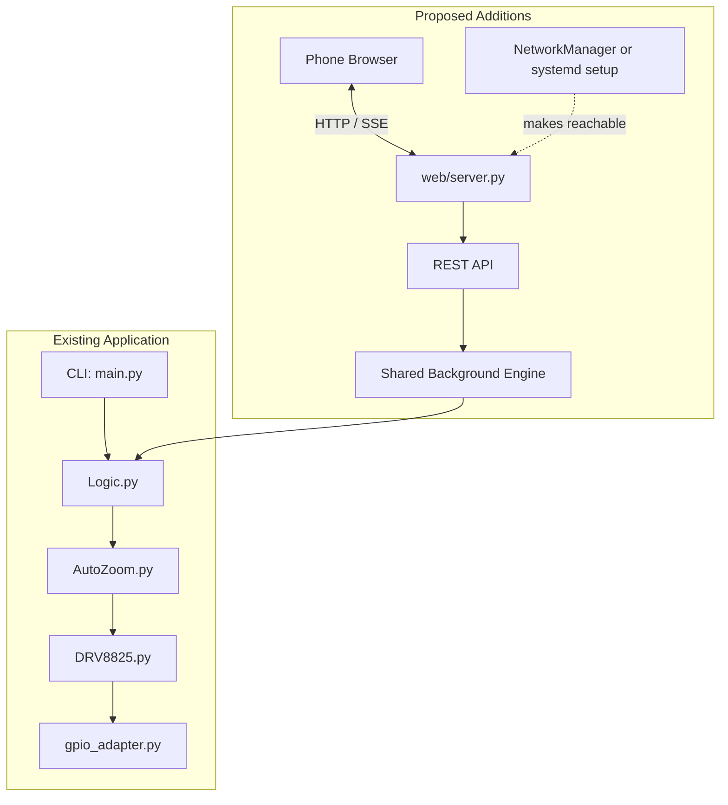
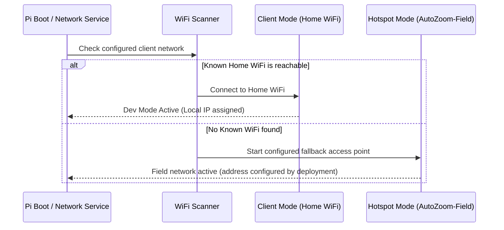

# Architecture & Implementation Plan: Raspberry Pi Web UI & Auto-Hotspot

**Status**: Proposed; the web application, systemd service, and automatic hotspot are not implemented
**Date**: 2026-10-06
**Document**: `docs/plans/web_ui_and_autohotspot_plan.md`

---

## 1. Vision & Requirements

The **Auto Zoom Controller** is used outdoors for hours-long timelapse shoots where camera zoom is continuously adjusted with micro-precision. In the field, bringing a laptop or keyboard/monitor to run terminal commands is cumbersome and risky.

### Core Goals:
1. **Zero-Terminal Field Operation**: Access a responsive, touch-friendly Web UI from a smartphone or tablet immediately after connecting to the Raspberry Pi.
2. **Pre-Flight Diagnostics & Lens Calibration**:
   - Manual jog controls (Step In / Step Out) to find lens start/end stops.
   - Test rotation & microstep verification.
   - Hardware health check (RPi CPU temperature, GPIO responsiveness, simulation/dry-run toggle).
3. **Timelapse Mission Planning & Profile Preview**:
   - Intuitive inputs: Total shoot time (hours/minutes), Interval between steps (seconds), Total throw (motor steps), Direction (zoom in / zoom out), Microstepping resolution.
   - Real-time calculations: Activations, steps per activation, duration per step, estimated completion time.
4. **Resilient Background Execution & Live Monitoring**:
   - Non-blocking execution running as a background daemon/thread.
    - Browser closure or a temporary client disconnect does not stop a mission; hardware, power, and process failures remain explicit failure cases.
    - Reconnecting retrieves authoritative mission status from the Pi.
   - Emergency Stop, Pause, and Resume capabilities.
5. **Home and Field Networking**:
    - **Home mode**: Use a configured home Wi-Fi connection; a local hostname is available only if mDNS is configured.
    - **Field mode**: Optionally fall back to an access point when the configured client network is unavailable. Choose and verify the trigger, address, DHCP range, and credentials for each supported OS; none are currently configured by this project.
6. **Code Reusability & Minimal Core Changes**:
   - Existing motor logic (`Logic.py`, `AutoZoom.py`, `DRV8825.py`, `DRV8825_Helper.py`) remains untouched or cleanly refactored so that **both CLI and Web UI** share the exact same underlying motor controller.

---

## 2. High-Level System Architecture



The upper path is the current implementation. The lower path is a target architecture; none of its web, engine, API, or networking components currently exist.

---

## 3. Web UI UX & Visual Design

### 3.1 Design Language
- **Dark Mode Aesthetic**: Deep slate/charcoal background (`#12161f`), high-contrast OLED-friendly accents, minimum night-sky light pollution.
- **Touch-First Controls**: Large thumb-friendly touch targets (min 48px), bold typography, slider + numeric input pairs.
- **Field-Ready Safety**: Clear confirmation dialogs for destructive actions (e.g. starting a 5-hour run or aborting).

### 3.2 Screen Structure & Components

Illustrative only: connection state, address, and telemetry are not available until their supporting services and sensors are implemented.

```
+-----------------------------------------------------------+
| [AutoZoom]        [WiFi: Field AP]                    |
+-----------------------------------------------------------+
| 🟢 STATUS: IDLE / READY                                   |
+-----------------------------------------------------------+
| 🛠 PRE-FLIGHT DIAGNOSTICS & JOG                           |
|   [◀◀ -500]  [◀ -50]   [DRY RUN: ON/OFF]   [+50 ▶] [+500 ▶▶] |
|   [Test Motor (1 Rev)]   [Check Hardware Sensors]          |
+-----------------------------------------------------------+
| ⚙️ TIMELAPSE MISSION CONFIGURATION                        |
|   Duration:   [ 2 ] Hours  [ 30 ] Mins                    |
|   Interval:   [ 5 ] Seconds                               |
|   Total Throw:[ 4000 ] Steps   [Preset: 24-70mm ▼]        |
|   Direction:  (●) Zoom In (Tele)   (○) Zoom Out (Wide)    |
|   Microstep:  [Full Step (1/1) ▼]                         |
+-----------------------------------------------------------+
| 📊 PROFILE SUMMARY                                        |
|   • Total Activations: 1,800                              |
|   • Steps per Activation: 2.22 steps                      |
|   • Est. Completion: 18:45 (in 2h 30m)                    |
+-----------------------------------------------------------+
|               [ ▶ START TIMELAPSE MISSION ]                |
+-----------------------------------------------------------+
| 🔴 LIVE MISSION MONITOR (Active Run)                      |
|   Progress: [=====================>       ] 64%           |
|   Time: Elapsed 01:36:00 / Remaining 00:54:00             |
|   Next Motor Step in: 00:03                               |
|   [ ⏸ PAUSE ]                  [ ⏹ EMERGENCY STOP ]       |
+-----------------------------------------------------------+
| 📜 Event Log (Live):                                      |
|   16:15:02 - Step 1152 completed (2 steps)                |
+-----------------------------------------------------------+
```

---

## 4. Frontend Code Architecture (Proposed)

- **Stack**: Vanilla HTML5, CSS, and JavaScript; avoid a Node build chain on the Pi.
- **No external CDN dependencies needed**: Works 100% offline in the middle of nowhere without internet access.
- **Planned file structure** (new `web/` files extend the current flat Python package):
  ```
  src/auto_zoom_controller/web/
  ├── __init__.py
  ├── server.py             # Flask application and API routes
  ├── templates/
  │   └── index.html
  └── static/
      ├── css/
      │   └── app.css
      └── js/
          ├── app.js
          └── api.js
  ```

### 4.1 Resilient Telemetry Strategy (SSE / Polling)
- Proposed transport: **Server-Sent Events (`/api/stream`)** with **REST polling (`/api/status`)** as a reconnect fallback.
- On reconnect, the client should fetch current server state rather than assume the mission stopped or continue from stale browser state.
- This behavior is not implemented; acceptance tests must cover lost connections and reconnects.

---

## 5. Backend Architecture (Flask & Non-Blocking Engine)

### 5.1 Proposed Technology: Python Flask
- Flask is a proposal, not a current dependency; `pyproject.toml` currently declares no web framework.
- Add Flask as an optional `web` extra so CLI-only installs do not acquire server dependencies.
- Select and test a production server on the target Pi before deployment. Do not use Flask's development server as the field service.
- Measure memory and startup behavior on the intended Pi model instead of assuming a fixed resource footprint.

### 5.2 Background Worker & State Machine
The current `main.py` owns argument parsing, timing, and the activation loop, and calls `AutoZoom` directly. It has no background engine or run-state API. Extract an **`AutoZoomEngine`** that reuses the existing `Logic`, `AutoZoom`, and GPIO adapter modules; do not replace them with the previously proposed `core/logic.py` and `core/motor.py` duplicate structure.

The proposed engine has these states:
```
States: [IDLE] <---> [RUNNING] <---> [PAUSED]
           \             |             /
            \---> [STOPPED / ERROR] <-/
```

- **Non-blocking Requests**: Start missions outside the web request thread, using a single worker so multiple requests cannot drive the motor concurrently.
- **Thread Safety**: Protect state transitions and mission configuration; use cooperative pause/stop signals.
- **Engine Methods**:
  - `start(config)`: Validates and snapshots configuration before starting a mission.
  - `pause()` / `resume()`: Cooperatively control scheduling and define what happens to an in-progress motor movement.
  - `stop()`: Stops at a documented safe boundary, disables the motor, and releases GPIO.
  - `jog(steps, direction)`: Allows bounded movement only after the safety/position policy is implemented.
  - `get_state()`: Returns a snapshot of status, progress, elapsed time, next activation, and errors.
- **CLI Compatibility**: The existing CLI should call the same engine after extraction; preserve its arguments and behavior with regression tests.

### 5.3 REST API Endpoints
| Endpoint | Method | Description |
|---|---|---|
| `GET /` | GET | Serves Web UI |
| `GET /api/status` | GET | Current engine status, progress, timing, and errors |
| `GET /api/stream` | GET | Server-Sent Events stream for push updates |
| `POST /api/diagnostics/jog` | POST | Move motor N steps for lens zeroing/testing |
| `POST /api/diagnostics/test` | POST | Run 1 full rotation or sensor test |
| `POST /api/start` | POST | Start timelapse with payload `{duration_min, interval_sec, total_steps, direction, microstep}` |
| `POST /api/pause` | POST | Pause running timelapse |
| `POST /api/resume` | POST | Resume paused timelapse |
| `POST /api/stop` | POST | Emergency abort / stop |
| `GET /api/system` | GET | Available system info (CPU temperature and network state when supported) |

Battery telemetry is not available in the current hardware design; expose it only if a sensor is added. Validate and bound all motor-affecting request fields server-side. Protect start, jog, and stop endpoints; a Wi-Fi password alone must not be treated as application authorization.

---

## 6. Shared Core (CLI & Web UI Parity)

The package currently has a flat layout:

```
src/auto_zoom_controller/
├── main.py                # Existing CLI and timing loop
├── Logic.py               # Existing motion calculations
├── AutoZoom.py            # Existing activation/motor wrapper
├── DRV8825.py             # Existing step/dir GPIO driver
├── DRV8825_Helper.py      # Existing direction/microstep constants
└── gpio_adapter.py        # Existing real/mock GPIO proxy
```

Add `web/` and an engine module within this package, reusing the existing modules instead of introducing parallel copies with different names. `auto-zoom` is the only current entry point; `auto-zoom-web` is a proposed entry point and must be added to `pyproject.toml` when implemented.

The current GPIO proxy automatically falls back to mock GPIO when the real driver is unavailable, and `--dry-run` explicitly selects emulation. This supports local API/UI tests, but does not validate real GPIO behavior.

---

## 7. Dev Mode vs. Prod Mode: Auto-Hotspot Solution

### 7.1 Current State and Goal
- The repository does not configure Wi-Fi profiles, create a hotspot, install a network fallback service, or install an Auto Zoom systemd service.
- The README describes manual installation of the third-party RaspberryConnect AutoHotspot installer; that is separate from this project and is not integrated with `install_pi.sh`.
- Keep development mode and field access as deployment options, not assumptions about what every Pi OS image does by default.

### 7.2 Deployment Modes
- **Dev Mode (Home)**: Pi connects to home Wi-Fi (`Home-WiFi`). You connect from your Mac via `ssh pi@autozoom.local` or browse `http://autozoom.local:5000`.
- **Prod Mode (Field)**: Pi is miles away from home. If it boots and waits for `Home-WiFi`, it hangs in client mode with no IP address. Your phone cannot connect, rendering the Pi inaccessible without a keyboard/screen.

### 7.3 Proposed Hotspot Fallback
Evaluate the Pi OS networking stack first. Do not assume connection-profile priority alone guarantees a timed fallback; verify the behavior on each supported OS and preserve existing user network configuration.



### 7.4 Implementation Options for Auto-Hotspot
1. **NetworkManager fallback (where supported)**:
   - Prefer supported NetworkManager configuration when the target image uses it.
   - Implement a tested fallback trigger and explicit SSID, address, and DHCP configuration; profile priority by itself is not an acceptance test.
2. **Dedicated Fallback Daemon (`scripts/autohotspot.sh` + systemd)**:
   - Consider only for OS releases where the native setup is unavailable or insufficient.
   - Make the network manager and DHCP/DNS implementation explicit; avoid competing with NetworkManager or `wpa_supplicant` for the same interface.
   - Require an opt-in setup, rollback/uninstall instructions, and tests for recovery to client Wi-Fi.

### 7.5 Proposed Phone Field Workflow
1. Turn on Raspberry Pi battery power pack in the field.
2. Wait for the configured access point to become available; timeout must be measured on supported hardware.
3. Connect to the operator-configured SSID using a non-default password.
4. Open Safari/Chrome and navigate to the address documented by the installed network configuration.
5. Run jog diagnostics, set parameters, click **Start Timelapse**.
6. Confirm mission status, then disconnect or lock the phone; the server-side mission continues unless a documented system fault occurs.

---

## 8. Phased Implementation Roadmap

**Prerequisites**: Complete the installer validation in Phase 8 of `modernization_plan.md` and the position/timing safety work in `product_improvement_plan.md` before enabling live web jog or mission controls.

| Phase | Milestone | Deliverables |
|---|---|---|
| **Phase 1** | **Shared Engine** | Extract the scheduler and mission state from `main.py`; preserve CLI behavior and reuse current `Logic.py`, `AutoZoom.py`, and GPIO adapter. |
| **Phase 2** | **Safety and Diagnostics** | Implement bounded jog and mission controls backed by the safety/position policy; provide dry-run state and supported hardware diagnostics. |
| **Phase 3** | **API and Server** | Add Flask as an optional web dependency, authenticated/validated REST endpoints, and the status/SSE transport. |
| **Phase 4** | **Mobile Web UI** | Add the responsive offline UI, mission summary, live status, reconnect behavior, and stop/pause/resume controls. |
| **Phase 5** | **Pi Service and Networking** | Add a tested systemd service and opt-in hotspot setup for supported OS releases, with secure credentials and rollback instructions. |
| **Phase 6** | **Integration and Field Validation** | Add engine/API tests, CLI regression tests, network/service tests where feasible, deployment instructions, and end-to-end Pi acceptance. |

---

## 9. Verification & Acceptance Criteria
1. **Desktop Simulation**: After implementation, the optional web server starts in mock mode on macOS/Linux; API/UI tests exercise dry-run without physical movement.
2. **CLI Compatibility**: Existing `auto-zoom` options and behavior remain available without installing the optional web extra.
3. **Safety and Authorization**: Invalid/out-of-range motor requests are rejected; motor-control routes are protected; stop and error paths leave GPIO and motor in a defined safe state.
4. **Disconnect Recovery**: Closing the browser or dropping Wi-Fi does not terminate a mission; reconnecting retrieves authoritative server state.
5. **Field Network Switching**: On every claimed supported Pi OS release, testing confirms client Wi-Fi operation and fallback AP behavior; a phone can reach the server on the documented address. No fixed 30-second claim is accepted until measured on hardware.
6. **Service Lifecycle**: The systemd service starts, stops, and restarts cleanly; GPIO is released on shutdown, and existing network settings can be restored.
