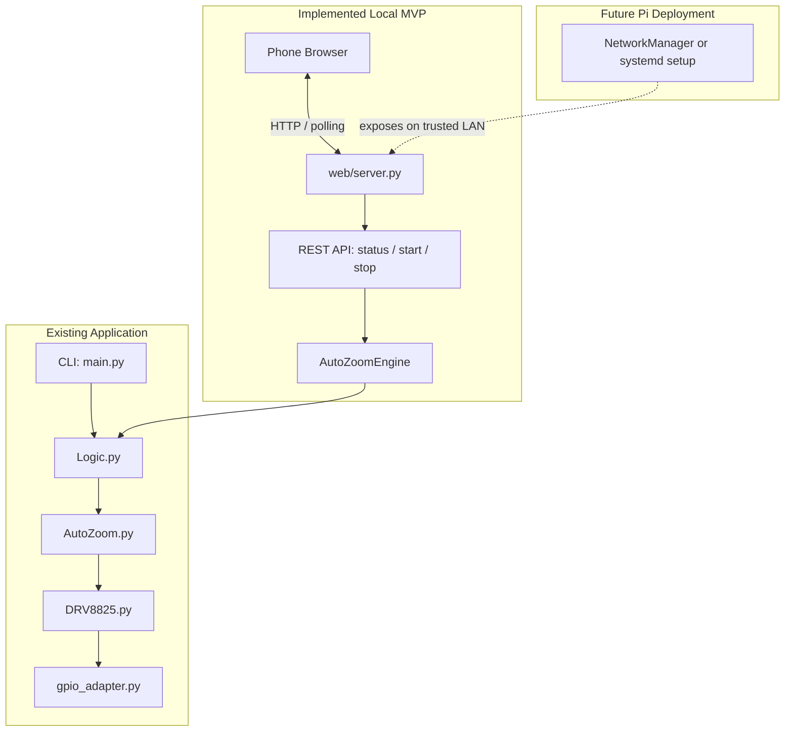
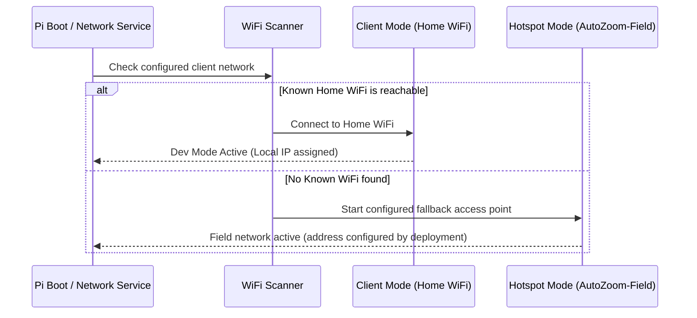

# Architecture & Implementation Plan: Raspberry Pi Web UI & Auto-Hotspot

**Status**: Local dry-run UI/API MVP implemented; live hardware controls, systemd, and automatic hotspot remain proposed
**Date**: 2026-10-06
**Document**: `docs/plans/web_ui_and_autohotspot_plan.md`

---

## 1. Vision & Requirements

The **Auto Zoom Controller** is used outdoors for hours-long timelapse shoots where camera zoom is continuously adjusted with micro-precision. In the field, bringing a laptop or keyboard/monitor to run terminal commands is cumbersome and risky.

### Core Goals:
1. **Zero-Terminal Field Operation**: Access a responsive, touch-friendly Web UI from a smartphone or tablet immediately after connecting to the Raspberry Pi.
2. **Pre-Flight Diagnostics & Lens Calibration**:
   - Manual jog controls (Step In / Step Out) to find lens start/end stops.
   - Test rotation & microstep verification.
   - Hardware health check (RPi CPU temperature, GPIO responsiveness, simulation/dry-run toggle).
3. **Timelapse Mission Planning & Profile Preview**:
   - Intuitive inputs: Total shoot time (hours/minutes), Interval between steps (seconds), Total throw (motor steps), Direction (zoom in / zoom out), Microstepping resolution.
   - Real-time calculations: Activations, steps per activation, duration per step, estimated completion time.
4. **Resilient Background Execution & Live Monitoring**:
   - Non-blocking execution running as a background daemon/thread.
    - Browser closure or a temporary client disconnect does not stop a mission; hardware, power, and process failures remain explicit failure cases.
    - Reconnecting retrieves authoritative mission status from the Pi.
   - Emergency Stop, Pause, and Resume capabilities.
5. **Home and Field Networking**:
    - **Home mode**: Use a configured home Wi-Fi connection; a local hostname is available only if mDNS is configured.
    - **Field mode**: Optionally fall back to an access point when the configured client network is unavailable. Choose and verify the trigger, address, DHCP range, and credentials for each supported OS; none are currently configured by this project.
6. **Code Reusability & Minimal Core Changes**:
   - Existing motor logic (`Logic.py`, `AutoZoom.py`, `DRV8825.py`, `DRV8825_Helper.py`) remains untouched or cleanly refactored so that **both CLI and Web UI** share the exact same underlying motor controller.

---

## 2. High-Level System Architecture



The CLI/GPIO path and localhost dry-run UI/API are implemented. Network exposure, production serving, live hardware controls, and networking configuration remain future work.

---

## 3. Web UI UX & Visual Design

### 3.1 Design Language
- **Dark Mode Aesthetic**: Deep slate/charcoal background (`#12161f`), high-contrast OLED-friendly accents, minimum night-sky light pollution.
- **Touch-First Controls**: Large thumb-friendly touch targets (min 48px), bold typography, slider + numeric input pairs.
- **Field-Ready Safety**: Clear confirmation dialogs for destructive actions (e.g. starting a 5-hour run or aborting).

### 3.2 Screen Structure & Components

Target wireframe only. The MVP currently implements mission configuration, preview, status/progress, dry-run start, and stop. The hotspot, jog, hardware diagnostics, sensor readings, pause/resume, and event log below remain future work.

```
+-----------------------------------------------------------+
| [AutoZoom]        [MODE: DRY RUN]                     |
+-----------------------------------------------------------+
| 🟢 STATUS: IDLE / READY                                   |
+-----------------------------------------------------------+
| 🛠 PRE-FLIGHT DIAGNOSTICS & JOG                           |
|   [◀◀ -500]  [◀ -50]   [DRY RUN: ON/OFF]   [+50 ▶] [+500 ▶▶] |
|   [Test Motor (1 Rev)]   [Check Hardware Sensors]          |
+-----------------------------------------------------------+
| ⚙️ TIMELAPSE MISSION CONFIGURATION                        |
|   Duration:   [ 2 ] Hours  [ 30 ] Mins                    |
|   Interval:   [ 5 ] Seconds                               |
|   Total Throw:[ 4000 ] Steps   [Preset: 24-70mm ▼]        |
|   Direction:  (●) Zoom In (Tele)   (○) Zoom Out (Wide)    |
|   Microstep:  [Full Step (1/1) ▼]                         |
+-----------------------------------------------------------+
| 📊 PROFILE SUMMARY                                        |
|   • Total Activations: 1,800                              |
|   • Steps per Activation: 2.22 steps                      |
|   • Est. Completion: 18:45 (in 2h 30m)                    |
+-----------------------------------------------------------+
|               [ ▶ START TIMELAPSE MISSION ]                |
+-----------------------------------------------------------+
| 🔴 LIVE MISSION MONITOR (Active Run)                      |
|   Progress: [=====================>       ] 64%           |
|   Time: Elapsed 01:36:00 / Remaining 00:54:00             |
|   Next Motor Step in: 00:03                               |
|   [ ⏸ PAUSE ]                  [ ⏹ EMERGENCY STOP ]       |
+-----------------------------------------------------------+
| 📜 Event Log (Live):                                      |
|   16:15:02 - Step 1152 completed (2 steps)                |
+-----------------------------------------------------------+
```

---

## 4. Frontend Code Architecture (Implemented MVP)

- **Stack**: Vanilla HTML5, CSS, and JavaScript; avoid a Node build chain on the Pi.
- **No external CDN dependencies needed**: Works 100% offline in the middle of nowhere without internet access.
- **Current file structure** (`web/` is an optional package within the existing Python package):
  ```
  src/auto_zoom_controller/web/
  ├── __init__.py
  ├── server.py             # Flask application and API routes
  ├── templates/
  │   └── index.html
  └── static/
      ├── css/
      │   └── app.css
      └── js/
          ├── app.js
          └── api.js
  ```

### 4.1 Resilient Telemetry Strategy (SSE / Polling)
- The MVP polls **`GET /api/status` once per second**; there is no SSE endpoint yet.
- Reloading the page fetches authoritative engine state, so a browser disconnect does not cancel the in-process dry-run mission.
- SSE may be added later if polling is insufficient on the target Pi.

---

## 5. Backend Architecture (Flask & Non-Blocking Engine)

### 5.1 Implemented Technology: Python Flask
- Flask is available through the optional `web` extra; CLI-only installs do not require it.
- `auto-zoom-web` runs Flask on `127.0.0.1:5000` and uses the development server only for local dry-run work.
- A production WSGI server and target-Pi resource measurements remain future deployment work.

### 5.2 Background Worker & State Machine
`AutoZoomEngine` now owns the shared absolute-time scheduler and reuses the existing `Logic`, `AutoZoom`, and GPIO adapter modules. The CLI calls it synchronously; the web API starts it on one background worker. The engine is in `engine.py` in the existing flat package, not a parallel `core/logic.py` or `core/motor.py` tree.

The implemented states are:
```
IDLE --> RUNNING --> COMPLETED
                         |  \
                         |   --> ERROR
                         --> STOPPING --> STOPPED
```

- **Implemented methods**: `start(config)`, `run(config)`, `stop(wait=False)`, and `get_status()`.
- **Single mission**: Concurrent starts are rejected; the worker continues if the browser disconnects, but its state is in memory and is lost if the server process exits.
- **Stop behavior**: The event interrupts the interval wait. An activation already inside `AutoZoom.job()` finishes before the worker disables the motor and marks the mission stopped.
- **Intentionally deferred**: Pause/resume and manual jog require additional interruption semantics and the position-safety policy; neither is exposed in this MVP.
- **CLI Compatibility**: The existing CLI flags and synchronous behavior are preserved through the same engine.

### 5.3 Implemented MVP Endpoints
| Endpoint | Method | Description |
|---|---|---|
| `GET /` | GET | Serves Web UI |
| `GET /api/status` | GET | Current engine status, progress, timing, and errors |
| `POST /api/start` | POST | Starts a validated dry-run mission; accepts interval, duration, steps, and direction |
| `POST /api/stop` | POST | Requests stop between activations |

The web process is bound to loopback, and `/api/start` creates `MissionConfig(dry_run=True)`. This is the same engine setting selected when the CLI parses `--dry-run`; the web server does not invoke the CLI parser or a subprocess. Requests are validated and bounded (minimum interval, maximum duration, steps, and activations); concurrent missions return `409`. Before binding this API to a LAN, add authentication and complete the hardware safety/position policy. SSE, jog, pause/resume, and system telemetry are not implemented.

---

## 6. Shared Core (CLI & Web UI Parity)

The package currently has a flat layout:

```
src/auto_zoom_controller/
├── main.py                # Existing CLI and timing loop
├── engine.py              # Shared mission scheduler and status
├── Logic.py               # Existing motion calculations
├── AutoZoom.py            # Existing activation/motor wrapper
├── DRV8825.py             # Existing step/dir GPIO driver
├── DRV8825_Helper.py      # Existing direction/microstep constants
├── gpio_adapter.py        # Existing real/mock GPIO proxy
└── web/
    ├── server.py          # Local dry-run Flask API
    ├── templates/index.html
    └── static/             # Local CSS and JavaScript
```

`auto-zoom` and `auto-zoom-web` are registered entry points. The web assets are included as package data, and Flask remains optional for CLI-only installs.

The current GPIO proxy automatically falls back to mock GPIO when the real driver is unavailable, and `--dry-run` explicitly selects emulation. This supports local API/UI tests, but does not validate real GPIO behavior.

---

## 7. Dev Mode vs. Prod Mode: Auto-Hotspot Solution

### 7.1 Current State and Goal
- The repository does not configure Wi-Fi profiles, create a hotspot, install a network fallback service, or install an Auto Zoom systemd service.
- The README describes manual installation of the third-party RaspberryConnect AutoHotspot installer; that is separate from this project and is not integrated with `install_pi.sh`.
- Keep development mode and field access as deployment options, not assumptions about what every Pi OS image does by default.

### 7.2 Deployment Modes
- **Dev Mode (Home)**: Pi connects to home Wi-Fi (`Home-WiFi`). You connect from your Mac via `ssh pi@autozoom.local` or browse `http://autozoom.local:5000`.
- **Prod Mode (Field)**: Pi is miles away from home. If it boots and waits for `Home-WiFi`, it hangs in client mode with no IP address. Your phone cannot connect, rendering the Pi inaccessible without a keyboard/screen.

### 7.3 Proposed Hotspot Fallback
Evaluate the Pi OS networking stack first. Do not assume connection-profile priority alone guarantees a timed fallback; verify the behavior on each supported OS and preserve existing user network configuration.



### 7.4 Implementation Options for Auto-Hotspot
1. **NetworkManager fallback (where supported)**:
   - Prefer supported NetworkManager configuration when the target image uses it.
   - Implement a tested fallback trigger and explicit SSID, address, and DHCP configuration; profile priority by itself is not an acceptance test.
2. **Dedicated Fallback Daemon (`scripts/autohotspot.sh` + systemd)**:
   - Consider only for OS releases where the native setup is unavailable or insufficient.
   - Make the network manager and DHCP/DNS implementation explicit; avoid competing with NetworkManager or `wpa_supplicant` for the same interface.
   - Require an opt-in setup, rollback/uninstall instructions, and tests for recovery to client Wi-Fi.

### 7.5 Proposed Phone Field Workflow
1. Turn on Raspberry Pi battery power pack in the field.
2. Wait for the configured access point to become available; timeout must be measured on supported hardware.
3. Connect to the operator-configured SSID using a non-default password.
4. Open Safari/Chrome and navigate to the address documented by the installed network configuration.
5. Run jog diagnostics, set parameters, click **Start Timelapse**.
6. Confirm mission status, then disconnect or lock the phone; the server-side mission continues unless a documented system fault occurs.

---

## 8. Phased Implementation Roadmap

**Prerequisites for live hardware/network control**: Complete the installer validation in Phase 8 of `modernization_plan.md` and the position/timing safety work in `product_improvement_plan.md`. The implemented web MVP is loopback-only and simulation-only.

| Phase | Milestone | Deliverables |
|---|---|---|
| **Phase 1** | **Shared Engine - MVP COMPLETE** | Shared absolute scheduler and status used by the synchronous CLI and one web worker; CLI behavior is regression-tested. |
| **Phase 2** | **Safety and Diagnostics - PENDING** | Add position limits, verified stop semantics, and bounded jog before allowing live motor commands. |
| **Phase 3** | **API and Server - MVP COMPLETE** | Optional Flask dependency; localhost-only status/start/stop API; starts force dry-run. Authentication and live controls remain pending before any LAN binding. |
| **Phase 4** | **Mobile Web UI - MVP COMPLETE** | Responsive local form, mission preview, one-second status polling, progress, and stop control. Pause/resume and field-network access remain pending. |
| **Phase 5** | **Pi Service and Networking - PENDING** | Add a tested systemd service and opt-in hotspot setup for supported OS releases, with secure credentials and rollback instructions. |
| **Phase 6** | **Integration and Field Validation - MVP TESTS PASS; PI PENDING** | Engine/API tests and CLI regression tests pass locally; complete network/service tests and end-to-end Pi acceptance later. |

---

## 9. Verification & Acceptance Criteria
1. **Desktop Simulation - MVP PASS**: Flask test-client coverage verifies the UI assets, status/start/stop APIs, validation, and forced dry-run; a local smoke run verifies the `auto-zoom-web` entry point.
2. **CLI Compatibility - MVP PASS**: Existing CLI tests and dry-run continue to pass through the shared engine without requiring Flask at runtime.
3. **Safety and Authorization - LIVE CONTROL PENDING**: The MVP rejects invalid inputs, binds only to loopback, and always uses mock GPIO. Add position limits and authentication before exposing live motor controls to a network.
4. **Disconnect Recovery - MVP PASS**: Mission execution belongs to the server worker, not the browser; reopening the page reads current state from `/api/status`. Process restart recovery is not provided.
5. **Field Network Switching - PENDING**: On every claimed supported Pi OS release, verify client Wi-Fi and fallback AP behavior and the documented address on hardware.
6. **Service Lifecycle - PENDING**: Verify systemd start/stop/restart, GPIO cleanup, and network rollback after those services are implemented.
