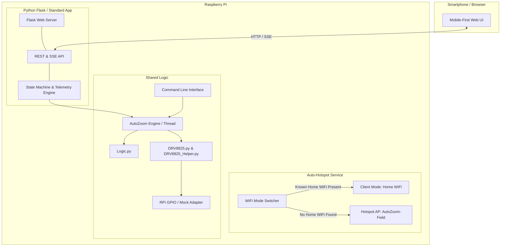
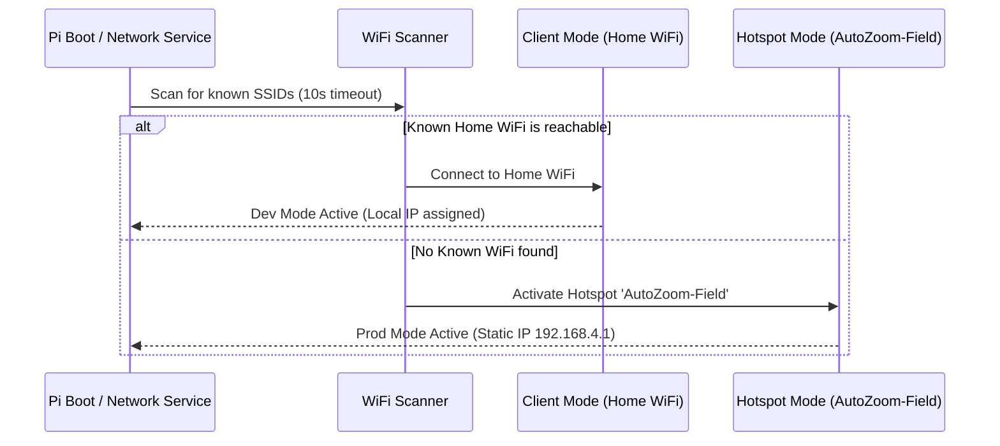

# Architecture & Implementation Plan: Raspberry Pi Web UI & Auto-Hotspot

**Status**: Proposed
**Date**: 2026-10-06
**Document**: `docs/plans/web_ui_and_autohotspot_plan.md`

---

## 1. Vision & Requirements

The **Auto Zoom Controller** is used outdoors for hours-long timelapse shoots where camera zoom is continuously adjusted with micro-precision. In the field, bringing a laptop or keyboard/monitor to run terminal commands is cumbersome and risky.

### Core Goals:
1. **Zero-Terminal Field Operation**: Access a responsive, touch-friendly Web UI from a smartphone or tablet immediately after connecting to the Raspberry Pi.
2. **Pre-Flight Diagnostics & Lens Calibration**:
   - Manual jog controls (Step In / Step Out) to find lens start/end stops.
   - Test rotation & microstep verification.
   - Hardware health check (RPi CPU temperature, GPIO responsiveness, simulation/dry-run toggle).
3. **Timelapse Mission Planning & Profile Preview**:
   - Intuitive inputs: Total shoot time (hours/minutes), Interval between steps (seconds), Total throw (motor steps), Direction (zoom in / zoom out), Microstepping resolution.
   - Real-time calculations: Activations, steps per activation, duration per step, estimated completion time.
4. **Resilient Background Execution & Live Monitoring**:
   - Non-blocking execution running as a background daemon/thread.
   - If the smartphone screen turns off, connection drops, or the browser closes, the timelapse **never stops**.
   - Reconnecting any browser immediately syncs with the live progress and telemetry.
   - Emergency Stop, Pause, and Resume capabilities.
5. **Seamless Dual-Mode Networking (Dev Mode vs. Prod Mode)**:
   - **Dev Mode (Home / Studio)**: Connects automatically to known home Wi-Fi; reachable via local network hostname (`autozoom.local`) or local IP.
   - **Prod Mode (Field)**: If home Wi-Fi is not detected within 15–20 seconds of boot, automatically switches into an Access Point / Hotspot (`AutoZoom-Field`) with captive DHCP (`192.168.4.1` or `10.42.0.1`), allowing direct phone connection without manual intervention.
6. **Code Reusability & Minimal Core Changes**:
   - Existing motor logic (`Logic.py`, `AutoZoom.py`, `DRV8825.py`, `DRV8825_Helper.py`) remains untouched or cleanly refactored so that **both CLI and Web UI** share the exact same underlying motor controller.

---

## 2. High-Level System Architecture



---

## 3. Web UI UX & Visual Design

### 3.1 Design Language
- **Dark Mode Aesthetic**: Deep slate/charcoal background (`#12161f`), high-contrast OLED-friendly accents, minimum night-sky light pollution.
- **Touch-First Controls**: Large thumb-friendly touch targets (min 48px), bold typography, slider + numeric input pairs.
- **Field-Ready Safety**: Clear confirmation dialogs for destructive actions (e.g. starting a 5-hour run or aborting).

### 3.2 Screen Structure & Components

```
+-----------------------------------------------------------+
| [⚡ AutoZoom]     [WiFi: Hotspot (192.168.4.1)]   [42°C]  |
+-----------------------------------------------------------+
| 🟢 STATUS: IDLE / READY                                   |
+-----------------------------------------------------------+
| 🛠 PRE-FLIGHT DIAGNOSTICS & JOG                           |
|   [◀◀ -500]  [◀ -50]   [DRY RUN: ON/OFF]   [+50 ▶] [+500 ▶▶] |
|   [Test Motor (1 Rev)]   [Check Hardware Sensors]          |
+-----------------------------------------------------------+
| ⚙️ TIMELAPSE MISSION CONFIGURATION                        |
|   Duration:   [ 2 ] Hours  [ 30 ] Mins                    |
|   Interval:   [ 5 ] Seconds                               |
|   Total Throw:[ 4000 ] Steps   [Preset: 24-70mm ▼]        |
|   Direction:  (●) Zoom In (Tele)   (○) Zoom Out (Wide)    |
|   Microstep:  [Full Step (1/1) ▼]                         |
+-----------------------------------------------------------+
| 📊 PROFILE SUMMARY                                        |
|   • Total Activations: 1,800                              |
|   • Steps per Activation: 2.22 steps                      |
|   • Est. Completion: 18:45 (in 2h 30m)                    |
+-----------------------------------------------------------+
|               [ ▶ START TIMELAPSE MISSION ]                |
+-----------------------------------------------------------+
| 🔴 LIVE MISSION MONITOR (Active Run)                      |
|   Progress: [=====================>       ] 64%           |
|   Time: Elapsed 01:36:00 / Remaining 00:54:00             |
|   Next Motor Step in: 00:03                               |
|   [ ⏸ PAUSE ]                  [ ⏹ EMERGENCY STOP ]       |
+-----------------------------------------------------------+
| 📜 Event Log (Live):                                      |
|   16:15:02 - Step 1152 completed (2 steps)                |
+-----------------------------------------------------------+
```

---

## 4. Frontend Code Architecture (Lightweight & Standard)

To avoid complex build pipelines, `node_modules`, and compilation on the Raspberry Pi:
- **Stack**: Standard Vanilla HTML5, Vanilla CSS3 (CSS variables, flexbox/grid), and ES6+ JavaScript.
- **No external CDN dependencies needed**: Works 100% offline in the middle of nowhere without internet access.
- **File Structure**:
  ```
  src/auto_zoom_controller/web/
  ├── __init__.py
  ├── server.py             # Flask application & API routes
  ├── templates/
  │   └── index.html        # Clean semantic HTML5 layout
  └── static/
      ├── css/
      │   └── app.css       # Responsive dark-theme styling
      └── js/
          ├── app.js        # UI logic, state listener, event handlers
          └── api.js        # REST client & SSE/polling connection
  ```

### 4.1 Resilient Telemetry Strategy (SSE / Polling)
- Uses **Server-Sent Events (`/api/stream`)** with automatic fallback to **REST polling (`/api/status` every 1.5s)**.
- If the phone screen locks or Wi-Fi drops momentarily, when the browser tab re-opens, it queries `GET /api/status` and instantly re-renders the current progress, elapsed time, and countdown.

---

## 5. Backend Architecture (Flask & Non-Blocking Engine)

### 5.1 Technology Choice: Python Flask
- **Why Flask?**
  - Standard, battle-tested, lightweight micro-framework.
  - Zero heavy C-extension compilation required on Raspberry Pi (available via `pip` or system `python3-flask`).
  - Native WSGI support, effortlessly run with `waitress` or `gunicorn` or builtin dev server.
  - Minimal memory footprint (<30MB RAM), ideal for Pi Zero W, Pi 3, Pi 4, and Pi 5.

### 5.2 Background Worker & State Machine
The core motor runner cannot block the web request thread. We introduce an **`AutoZoomEngine`**:
```
States: [IDLE] <---> [RUNNING] <---> [PAUSED]
           \             |             /
            \---> [STOPPED / ERROR] <-/
```

- **Threaded Execution**: Runs on a dedicated daemon thread `threading.Thread`.
- **Thread Safety**: State transitions protected via `threading.Lock` and pause/stop events via `threading.Event`.
- **Engine Methods**:
  - `start(config)`: Validates config, starts background thread.
  - `pause()` / `resume()`: Halts/resumes scheduling.
  - `stop()`: Clears schedule, powers down motor coils, releases GPIO.
  - `jog(steps, direction)`: Executes manual diagnostic movement.
  - `get_state()`: Returns snapshot dictionary (status, progress %, elapsed, remaining, next_step_in_seconds, current_step, total_steps).

### 5.3 REST API Endpoints
| Endpoint | Method | Description |
|---|---|---|
| `GET /` | GET | Serves Web UI |
| `GET /api/status` | GET | Current engine status, progress, battery/temp metrics |
| `GET /api/stream` | GET | Server-Sent Events stream for push updates |
| `POST /api/diagnostics/jog` | POST | Move motor N steps for lens zeroing/testing |
| `POST /api/diagnostics/test` | POST | Run 1 full rotation or sensor test |
| `POST /api/start` | POST | Start timelapse with payload `{duration_min, interval_sec, total_steps, direction, microstep}` |
| `POST /api/pause` | POST | Pause running timelapse |
| `POST /api/resume` | POST | Resume paused timelapse |
| `POST /api/stop` | POST | Emergency abort / stop |
| `GET /api/system` | GET | System info (CPU temp, Wi-Fi SSID/mode, IP address) |

---

## 6. Shared Core (CLI & Web UI Parity)

The existing CLI (`main.py`) and the Web UI will both share the exact same motor controller:

```
src/auto_zoom_controller/
├── core/
│   ├── engine.py          # State-managed background executor (NEW)
│   ├── logic.py           # Calculations (existing Logic.py)
│   ├── motor.py           # Motor hardware driver (existing DRV8825.py)
│   └── gpio_adapter.py    # GPIO abstraction + Mock adapter for dev
├── cli/
│   └── main.py            # CLI entry point (auto-zoom)
└── web/
    └── server.py          # Web UI entry point (auto-zoom-web)
```

- When running `auto-zoom -i 2 -d 60 -s 4000`: runs CLI mode directly in terminal.
- When running `auto-zoom-web --port 5000`: starts the web server daemon.
- When running on Mac/PC (Dev mode): mock GPIO activates automatically, allowing full frontend and backend testing without physical hardware!

---

## 7. Dev Mode vs. Prod Mode: Auto-Hotspot Solution

### 7.1 The Dilemma
- **Dev Mode (Home)**: Pi connects to home Wi-Fi (`Home-WiFi`). You connect from your Mac via `ssh pi@autozoom.local` or browse `http://autozoom.local:5000`.
- **Prod Mode (Field)**: Pi is miles away from home. If it boots and waits for `Home-WiFi`, it hangs in client mode with no IP address. Your phone cannot connect, rendering the Pi inaccessible without a keyboard/screen.

### 7.2 The Solution: Automated Hotspot Fallback (`autohotspot`)
Modern Raspberry Pi OS uses **NetworkManager** (`nmcli`) or `wpa_supplicant` + `hostapd`/`dnsmasq`. We implement an automated service script:



### 7.3 Implementation Options for Auto-Hotspot
1. **NetworkManager Native AP Fallback (Pi OS Bookworm / Debian 12 - Recommended)**:
   - Modern Pi OS Bookworm manages networking via NetworkManager.
   - NetworkManager natively supports automatic fallback:
     - Priority 1: Home Wi-Fi profile (autoconnect = true, priority = 100).
     - Priority 2: Hotspot profile (autoconnect = true, priority = 50, mode = ap, ssid = `AutoZoom-Field`, ip = `192.168.4.1/24`).
   - If Home Wi-Fi is not reachable within 15 seconds, NetworkManager immediately starts the AP hotspot!
2. **Dedicated Fallback Daemon (`scripts/autohotspot.sh` + systemd)**:
   - For Bullseye / Legacy systems or custom setups:
   - A lightweight bash script checks `nmcli -t -f SSID dev wifi list` or `iwlist wlan0 scan`.
   - If home SSID not found, toggles interface to AP mode with `dnsmasq` supplying DHCP (`192.168.4.10` to `192.168.4.50`).

### 7.4 Phone Field Workflow
1. Turn on Raspberry Pi battery power pack in the field.
2. Wait 30 seconds.
3. Open iPhone/Android Wi-Fi settings. Connect to **AutoZoom-Field** (Password: `autozoom123` or open).
4. Open Safari/Chrome and navigate to `http://192.168.4.1:5000` (or `http://autozoom.local:5000`).
5. Run jog diagnostics, set parameters, click **Start Timelapse**.
6. Put phone back in pocket — timelapse continues uninterrupted!

---

## 8. Phased Implementation Roadmap

| Phase | Milestone | Deliverables |
|---|---|---|
| **Phase 1** | **Core Refactoring & Engine** | Extract `AutoZoomEngine` with background threading, state tracking, and mock GPIO support. Ensure CLI works identically. |
| **Phase 2** | **Backend REST API** | Implement Flask app (`server.py`) with `/api/status`, `/api/diagnostics/jog`, `/api/start`, `/api/stop`. |
| **Phase 3** | **Frontend UI & Styling** | Create mobile-first dark UI (`index.html`, `app.css`, `app.js`) with zero external CDNs. |
| **Phase 4** | **Pre-flight & Safety Features** | Add manual jog controls, dry-run simulation mode, countdown timers, confirmation modals, and disconnect reconnection sync. |
| **Phase 5** | **Auto-Hotspot & Systemd Services** | Create `autohotspot.sh` script, NetworkManager configurations, and `autozoom.service` systemd unit for automatic boot launch. |
| **Phase 6** | **Documentation & Testing** | Comprehensive unit tests for engine & API, plus step-by-step field guide in `README.md`. |

---

## 9. Verification & Acceptance Criteria
1. **Desktop Simulation**: Running `python -m auto_zoom_controller.web.server` on macOS/Linux runs in mock mode, serving the UI on `http://localhost:5000` where jog, dry-run, start, pause, and stop can be tested completely without hardware.
2. **CLI Unbroken**: Running `auto-zoom` CLI commands still functions identically without web server dependencies.
3. **Field Network Switching**: Booting without home Wi-Fi starts the AP hotspot within 30 seconds; connecting from a phone loads the web application immediately.
